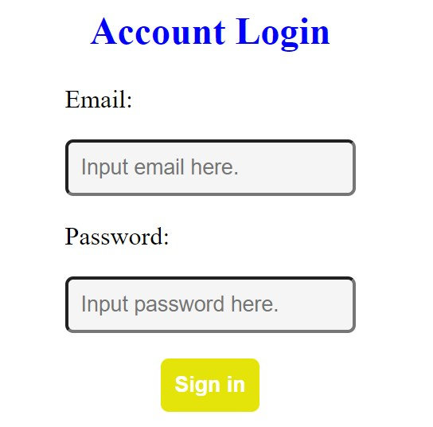

## Check Login System

### Introduction

This is simple web application for checking user list registered.

### Screenshot



### Features

- Registered user can log in
- Welcome back page for user logged in

### Start

1. Make sure Node.js and npm installed.
2. Store this project to local

```
git clone https://github.com/Coli-co/Login_authentication.git
```

3. Switch to project folder

```
cd Login_authentication
```

4. Install package required

```
npm install
```

5. Start project

```
npm run start
```

### Developer

- [Timothy](https://github.com/Coli-co)
